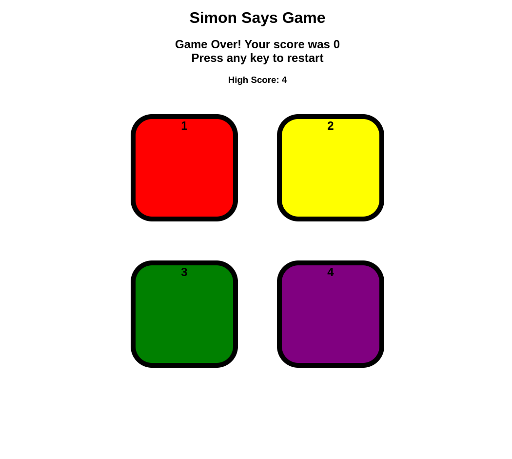

# 🎮 Simon Says Memory Game

This is a **Simon Says** memory-based game where players must remember and repeat an increasing sequence of colors.

## 🚀 How to Play?
1️⃣ **Press any key** to start the game.  
2️⃣ Watch carefully as a random color flashes.  
3️⃣ Click the same color button to repeat the sequence.  
4️⃣ If correct, the sequence gets longer, and you level up!  
5️⃣ **Make a mistake?** The screen turns red, a game-over sound plays, and you must restart.  

## 🏆 Features  
✅ **High Score Tracking** – Keeps track of your best performance.  
✅ **Sound Effects** – Plays different sounds for game start, button press, and game over.  
✅ **Visual Feedback** – Flash effects and background color changes.  

🎯 **Test your memory and reflexes—how far can you go?** 🔥

